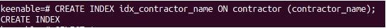
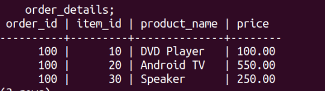
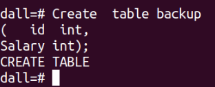
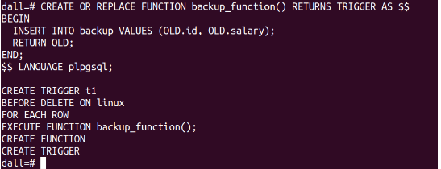
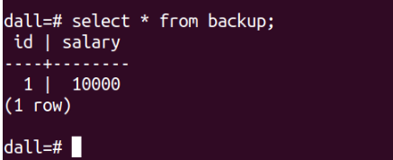
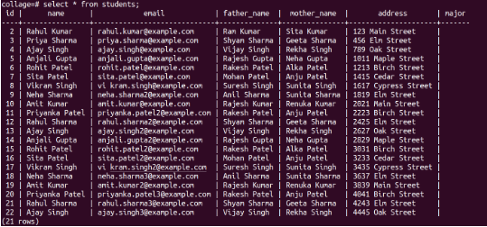
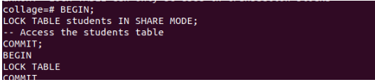
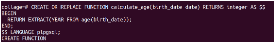

## 13. What are indexes,sequences,triggers,union,locks,materialised views,functions etc. with examples w.r.t your setup .

**(a) indexes**

- indexes ek aise data structure hain jo PostgreSQL ko data ko quickly find karne mein madad karte hain। ve ek ya adhik columns per create hote hain, aur ve un columns ke values ko sorted order mein store karte hain। yah PostgreSQL ko ek table mein rows ko quickly find karne ki anumati deta hai jo ek diye gaye value in range of values ke sath match karti hain।

>CREATE INDEX idx_contractor_name ON contractor (contractor_name);

> SELECT *
FROM contractor
WHERE contractor_name = 'praveen';

**(b) sequence**

- sequence ek aisi object hai jo unique numbers generate karti hai। unka upyog kabhi-kabhi tables ke liye primary key values generate karne ke liye kiya jata hai।

**trigger**
- trigger ek aise procedure hain jo automatically execute hote hain jab table per kuchh events hoti hain। ek example yah hai ki aap ek trigger create kar sakte hain jo ek naye row ko students table mein insert kiye jaane ke bad execute kiya jaaye। yah trigger fir school principal ko email notification send kar sakta hai।

**Trigger name is ‘ Backup’ table whenever data is deleted from ‘main’ table.**

>create table linux
(
id int,
salary int);

>insert into linux values(1,10000);
insert into linux values(2,20000);

>Create  table backup 
(   id  int,
Salary int);

>CREATE OR REPLACE FUNCTION backup_function() RETURNS TRIGGER AS
BEGIN 
INSERT INTO backup VALUES (OLD.id, OLD.salary);
RETURN OLD;
END;
$$ LANGUAGE plpgsql;
CREATE TRIGGER t1
BEFORE DELETE ON linux
FOR EACH ROW
EXECUTE FUNCTION backup_function();

>delete from linux where id=1;

- After show backup table

**union**

- union operator ka upyog 2 ya adhik SELECT statements ki results ko combine karne ke liye kiya jata hai। union operation ki results first column ke ascending order mein sort ki jaati hai

>SELECT * FROM new_students UNION SELECT * FROM person UNION SELECT * FROM students;

>ALTER TABLE students ADD COLUMN major VARCHAR(255);

**lock**

- lock ka upyog dusron ko aapke data ko modify karne se rokne ke liye kiya jata hai jo aap abhi modify kar rahe hain। yah data ki integrity ko ensure karne mein madad karta hai।

>collage=# select *from students;

>BEGIN;
LOCK TABLE students IN SHARE MODE;
-- Access the students table
COMMIT;
BEGIN
LOCK TABLE
COMMIT

**materialised view**

- materialised view table ke data ke precomputed views hain। unka upyog frequently executed queries ki performance improve karne ke liye kiya jata hai।

>CREATE MATERIALIZED VIEW new_students_materialized AS
SELECT *

>collage=# SELECT name, father_name
FROM new_students_materialized_view;

**function**

- function user-defined procedures hain jin ka upyog common tasks ko perform karne ke liye kiya ja sakta hai, jaise data ko format karna, values calculate karna, aur data ko validate karna।

- function to calculate the age:

>CREATE OR REPLACE FUNCTION calculate_age(date_of_birth date) RETURNS integer AS $$
DECLARE
age_in_years integer;
BEGIN
SELECT EXTRACT(YEAR FROM age(date_of_birth)) INTO age_in_years;
RETURN age_in_years;
END;LANGUAGE plpgsql;

- Now, you can use the calculate_age function to calculate the age of a person based on their birthdate. For example:

